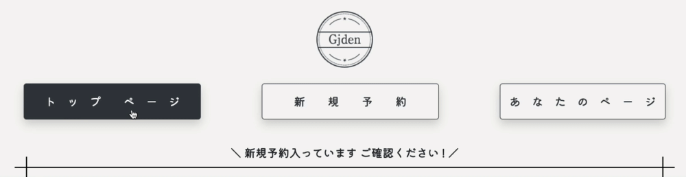
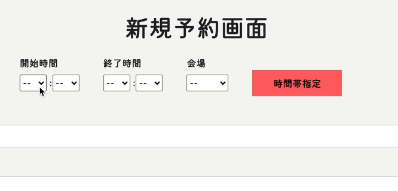
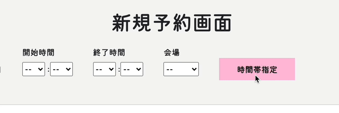
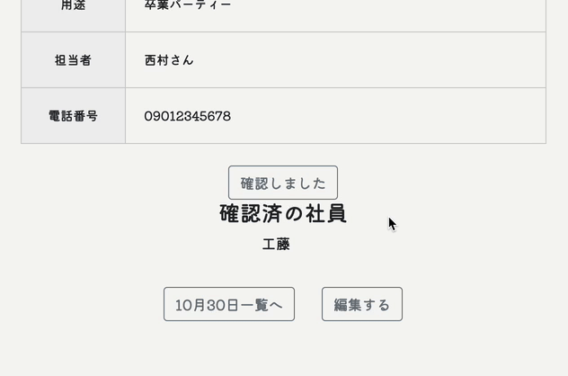

# Name ＜ Gjden--ジジデン ＞
〜迷える同僚<b>"おジジ社員"</b>をGoodJobに導く伝票アプリ〜 

# ＜ Overview--概要 ＞
【宴会場の予約伝票管理アプリ】 

宴会場及び、会議室などの貸し出しスペースの予約管理を目的とした社内用アプリケーションです 
 
＜このアプリケーションでどのような課題が解決できるのか？＞ 
①伝票の紛失するリスクをゼロへ 
②予約の重複リスクをゼロへ 
③全社員へ予約内容の共有 
④外出先でも確認が可能 
 
# ＜ Production environment--本番環境 ＞
ーURLーーーーーーーーーーーーーーーーー 
https://gjden1111.herokuapp.com/  
ID：admin 
PASS：2525 
ーーーーーーーーーーーーーーーーーーーー 
 
ー社員ユーザー１（佐々木）ーーーーーーーー 
メールアドレス：sasaki@test 
 パスワード：111aaa 
ーーーーーーーーーーーーーーーーーーーー 
 
ー社員ユーザー２（鈴木）ーーーーーーーーー 
メールアドレス：suzukii@test  
パスワード：aaa111  
ーーーーーーーーーーーーーーーーーーーー 
 
# ＜ Project justification--制作背景 ＞
【紙媒体での予約管理の不便さを解決したい】 
 
宴会場で働いている際、沢山ある会場の予約スケジュール管理を紙媒体で管理していました。 
新規予約の伝票を見落とした、無くしたという<b>トラブルを無くしたい</b>という思いからこのアプリが生まれました。 
また、<b>パソコンに苦手意識を持つ ”おジジ社員”</b> と共に働いていたことから、彼らにとって使いやすいアプリケーションにする事で<b>パソコンへの興味のきっかけとなってほしい</b>という願いも込められています。
 

# ＜ Top page--トップページ ＞
<b>【point1】</b> 
予約の確認漏れを防ぐため、未確認の伝票はこちらに全て表示されます。 
 
 
 
<b>【point2】</b> 
見たい日がすぐ見つかるようにカレンダー形式を採用しました。見たい日付をクリックすると指定の日付のページへ遷移します。 
日毎のページは昼と夜で分けて表示し、見やすくしました。 
 
# ＜ Ingenuity--工夫 ＞
<b>【アプリ内迷子をトップページへ導く】</b> 
パソコンが苦手なユーザーのために、ロゴマークに変化を付けました。 黒いロゴマークがトップページです。今どこのページを開いているのか分からなくなったら、黒いロゴマークを目標に戻ってきて下さいね！ 
 

<b>【仮予約の際は時間入力を短縮】</b> 
時間を入力のは少々手間ですね… 
 
⬇︎⬇︎⬇︎ 
今急いでいるからとりあえず仮予約！という時はこちらのボタンで指定の時間帯をワンクリックで入力ができます。 
 
また、時間短縮というところにフォーカスし、新規予約の際は記入に空欄があっても最低限の情報（日付、時間、会場、団体名）があれば登録が可能です。編集の際には全ての項目を入力しないと更新出来ないようバリデーションを工夫しました。 
 
<b>【新規予約の確認を可視化】</b> 
新たな予約に目を通してもらったら<b>”確認しました”</b>ボタンを押してもらい未確認の伝票を洗い出します。また、確認済の社員名が記載されることで未確認の社員へのフォローにも繋がると考えました。 
 
 
# ＜ Development Environment--開発環境 ＞
-Ruby on Rails 
 
-BootStrap 
 
-Simple Calendar 
 
# ＜ Remarks--備考 ＞
このアプリのデータベースにある名前・電話番号・メールアドレス・団体名などは、全て架空のものです。
 
## users テーブル

| Column             | Type   | Options                   |
| ------------------ | ------ | ------------------------- |
| last_name          | string | null: false               |
| first_name         | string | null: false               |
| email              | string | null: false, unique: true |
| encrypted_password | string | null: false               |

- has_many: reservations
- has_many: looks

## reservations テーブル

| Column        | Type       | Options                        |
| ------------- | ---------- | ------------------------------ |
| day           | date       | null: false                    |
| time          | time       | null: false                    |
| end_time      | time       | null: false                    |
| group_name    | string     | null: false                    |
| manager       | string     |                                |
| phone_number  | string     |                                |
| people_number | integer    |                                |
| room_id       | integer    | null: false                    |
| use           | string     |                                |
| user          | references | foreign_key: true              |
| start_time    | string     |                                |
| finish_time   | string     |                                |

- belongs_to: user
- has_many: looks

## looks テーブル

| Column      | Type        | Options                        |
| ----------- | ----------- | ------------------------------ |
| user        | references  | null: false, foreign_key: true |
| reservation | references  | null: false, foreign_key: true |

- belongs_to: user
- belongs_to: reservation
